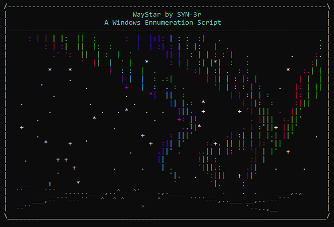

# WayStar
    
WayStar is a windows enummeration script designed to be visually appealing.

 ## The script performs the following:
- Perform Situational Awareness
- Find OS Information
- Find Users, Accounts, and Groups
- Find Passwords
- Detect Security 
- Find Scheduled Tasks and Files
- Perform Simple Powershell Commands

 WARNING: WayStar and other scripts by SYN-3r should only be used for educational purposes or for authorized pentesters. The author is not responisible for any misuse.
